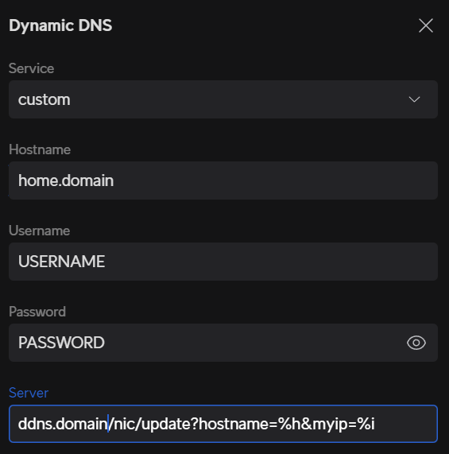

# Unifi DDNS with Route53

## Introduction

Unifi network devices support DDNS for a lot of common providers. Unfortunately,
route53 is not one of the out of the box supported providers. They do however
support the ability to specify custom providers thanks to their use of inadyn.
This repo sets up an AWS Lambda fronted by an API gateway that updates a dns
record specified in the configuration when it receives updates from your UniFi
device.

## AWS Setup

First, run the terraform in the terraform directory as a module. The call to
this module will look similar to the below example:

```
module "ddns" {
  source = "git@github.com:nckslvrmn/unifi_ddns_route53/terraform"

  hosted_zone_id = aws_route53_zone.public.zone_id
  domain_name    = "ddns.domain"
  acm_arn        = data.aws_acm_certificate.wildcard.arn
}
```

The only three inputs needed are:

| Name           | Value                                                                                        |
| -------------- | -------------------------------------------------------------------------------------------- |
| hosted_zone_id | the hosted zone id of the route53 dns zone to which you intend on publishing the DDNS record |
| domain_name    | the name of the DNS entry in that zone that will point to the API gateway receiving updates  |
| acm_arn        | the ARN of an ACM record that validates the DNS for `domain_name`                            |

Once the terraform is run, you will need to change the value of the ssm
parameter and update the lambdas source code. To do this, follow these steps:

1. run
   `aws ssm put-parameter --name "/unifi_ddns_route53_credentials" --value "USERNAME:PASSWORD" --type SecureString --overwrite`.
   This assumes your AWS permissions are set up properly for CLI use. Change the
   `USERNAME:PASSWORD` to values you want to use for authenticating this API.
   These will be used lated in the unifi setup.
2. run
   `cd lambda; zip function.zip lambda.py; aws lambda update-function-code --zip-file fileb://function.zip --function-name ddns`.
   This will place the code in the lambda and deploy it.

## UniFi Setup

On the UniFi side, you will have to enable Dynamic DNS. Under Settings, in the
advanced section of the Internet configuration for your WAN, you will see the
option for Dynamic DNS. Configuration has a few sections and should look like
this:



the configuration options are as follows:

| Name     | Value                                                                                                                                                                   |
| -------- | ----------------------------------------------------------------------------------------------------------------------------------------------------------------------- |
| Service  | set to `custom`                                                                                                                                                         |
| Hostname | set to the DNS record you want the API to update with your WAN IP                                                                                                       |
| Username | set to the username you specified in the AWS SSM Parameter                                                                                                              |
| Password | set to the password you specified in the AWS SSM Parameter                                                                                                              |
| Server   | set to the DNS name of the `domain_name` value set in the terraform module, with this URI on the end of it `/nic/update?hostname=%h&myip=%i`. Do not include `https://` |

If you have ssh enabled on your UniFi device, you can confirm these settings
have been stored by reading the `/run/ddns-eth8-inadyn.conf` file. You may also
want to run
`/usr/sbin/inadyn --force -n -C -1 -l debug -f /run/ddns-eth8-inadyn.conf` to
confirm your settings are correct.

## Conclusion

Once the above has been completed, your UniFi device should now send your API
the updated IP of your home WAN, and the Lambda will update its corresponding
DNS record. You may then use that A record as the target of other CNAMEs, or
however else you'd like.
